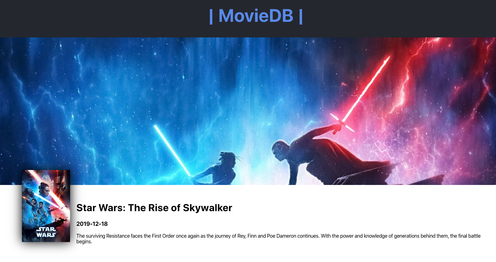

# MovieDB

## How to view project:

- First clone the repo to your local device.

- Next run `npm install` to install the depencies.

- Then run `npm start` and the project will be avaliable at localhost:3000

This is a project I made to get better at pulling data from an API while using React JS. I pulled the data from TheMovieDB(TMBD) and had a hard time figuring out how to hide my API keys but was able to in my .env file! I also added React Overdrive for the animation.
